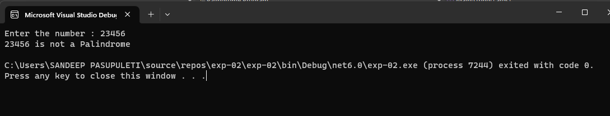
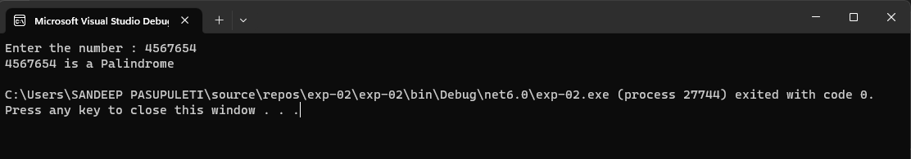

# Palindrome


## Aim:
To write a C# program to find whether the given string is a Palindrome or not.
## Algorithm:

### Step1: Start the Program.

### Step2: Create a class and declare two variable with string datatype

### Step3: Loop over the entire string and reverse it

### Step4: Use if condition to check whether the string and the reversed string is equal or not.

### Step5: Print palindrome if it's equal else print not a palindrome.

### Step6: Stop the Program.

## Program:

```
DEVELOPED BY : P.SANDEEP
REGISTER NO : 212221230074
```


```

using System;
namespace Palindrome
{
    class Program
    {
        public static void Main(string[] args)
        {
            int rev=0,rem,num;
            Console.Write("Enter the number : ");
            num = Convert.ToInt32(Console.ReadLine());
            int temp = num;
            while(num!=0)
            {
                rem = num % 10;
                rev = rev * 10 + rem;
                num = num / 10; 
            }
            if (rev==temp)
            {
                Console.WriteLine(temp + " is a Palindrome");
            }
            else
            {
                Console.WriteLine(temp + " is not a Palindrome");
            }
        }
    }
}

```
## Output:



## Result:
Thus the C# program to display whether the given string is Palindrome or not is executed successfully.
